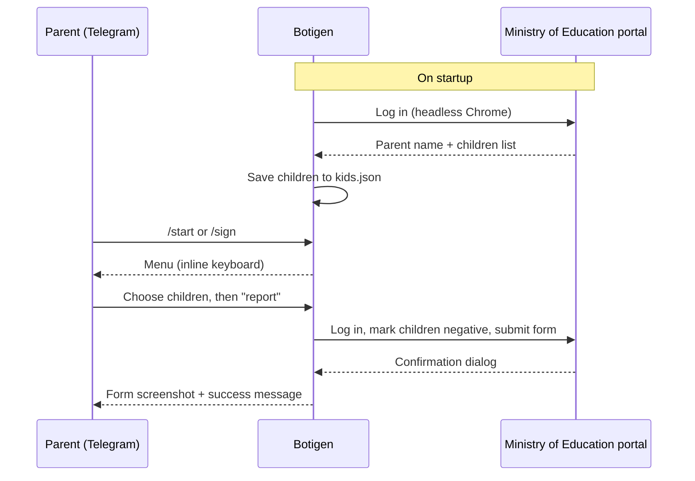

# Botigen

[](https://hub.docker.com/r/techblog/botigen)
[](License)

Botigen is a Telegram bot that submits the Israeli Ministry of Education
home antigen test declaration for your children. You tap a button in Telegram, and the bot logs
in to the Ministry's parents portal with a headless Chrome browser (Selenium), marks the
selected children as tested negative, submits the form, and sends you a screenshot of the
result.

It was built for parents who had to file this declaration repeatedly for several children
during the COVID-19 school antigen-testing period.

> [!NOTE]
> The bot automates a specific page of the Ministry of Education parents portal
> (`parents.education.gov.il`). If that page is changed or retired, the bot stops working.
> <!-- TODO: verify whether the home antigen test declaration page is still online -->

## Table of Contents

- [Features](#features)
- [How It Works](#how-it-works)
- [Requirements](#requirements)
- [Installation](#installation)
- [Configuration](#configuration)
- [Usage](#usage)
- [Security Notes](#security-notes)
- [Troubleshooting](#troubleshooting)
- [Development](#development)
- [Contributing](#contributing)
- [License](#license)

## Features

- Interactive Telegram menu with inline buttons (the bot's messages are in Hebrew).
- Report for **selected children**: pick one or more children from a list; picked children get a
  ✅ mark.
- Report for **all children** in one tap.
- Logs in to the Ministry of Education portal with your parent credentials and fills in the
  antigen test declaration (marks each selected child as negative) automatically.
- Sends a screenshot of the submitted form back to the chat as confirmation.
- Greets you by the parent name shown in the portal profile (falls back to your Telegram first
  name).
- Caches the children list in `kids.json`, so the menu opens quickly without logging in first.

## How It Works



1. On startup, the bot logs in to the portal, reads the parent name and the children's names and
   IDs, writes them to `kids.json`, and closes the browser.
2. It then polls Telegram for messages.
3. When you submit a report, it opens a new browser session, logs in again, selects the
   "negative" option for each chosen child, clicks **שליחה** (Send), accepts the confirmation
   dialog, and sends you a screenshot of the form.

## Requirements

- A Telegram bot token from [@BotFather](https://t.me/BotFather).
- Credentials for the Ministry of Education identification system (the username and password you
  use to log in to the parents portal).
- Docker (recommended). The image is based on `techblog/selenium`, which provides Chrome and
  ChromeDriver at `/opt/chromedriver/chromedriver`.
- To run without Docker: Python 3, Google Chrome, and a matching ChromeDriver at
  `/opt/chromedriver/chromedriver` (the path is hard-coded in `app/helpers.py`).

## Installation

### Docker

The image is published on Docker Hub as [`techblog/botigen`](https://hub.docker.com/r/techblog/botigen)
(`linux/amd64` only).

```bash
docker run -d \
  --name botigen \
  --restart unless-stopped \
  -e BOT_TOKEN="<telegram-bot-token>" \
  -e EDU_SITE_USER="<portal-username>" \
  -e EDU_SITE_PASSWORD="<portal-password>" \
  techblog/botigen:latest
```

### Docker Compose

```yaml
services:
  botigen:
    image: techblog/botigen:latest
    container_name: botigen
    restart: unless-stopped
    environment:
      BOT_TOKEN: "<telegram-bot-token>"
      EDU_SITE_USER: "<portal-username>"
      EDU_SITE_PASSWORD: "<portal-password>"
```

### Build from source

```bash
git clone https://github.com/t0mer/Botigen.git
cd Botigen
docker build -t botigen .
```

## Configuration

All configuration is done with environment variables.

| Variable | Required | Default | Description |
|---|---|---|---|
| `BOT_TOKEN` | Yes | – | Telegram bot token from @BotFather. |
| `EDU_SITE_USER` | Yes | – | Username for the Ministry of Education login. |
| `EDU_SITE_PASSWORD` | Yes | – | Password for the Ministry of Education login. |
| `PARENT_NAME` | No | Read from the portal profile | Name used in the welcome message. If it is empty and cannot be read from the portal, your Telegram first name is used. |
| `ALLOWED_IDS` | No | – | Declared in the Dockerfile and read by the code, but **not enforced** in the current version (see [Security Notes](#security-notes)). |

> [!NOTE]
> The Dockerfile declares `BOT_TOKEN`, `EDU_SITE_USER`, `EDU_SITE_PASSWORD` and `ALLOWED_IDS`
> with the legacy `ENV X = ""` syntax, so in the published image an unset variable is not empty:
> its value is the literal string `= `. Always set the required variables explicitly.

### Files

| Path (in the container) | Description |
|---|---|
| `/opt/app/kids.json` | Cached list of children (name, ID, index). Created on the first successful login. |
| `/opt/app/preview.png` | Screenshot of the last submitted form. |

The image does not declare a volume. To keep the children cache across container re-creation,
you can bind-mount a file to `/opt/app/kids.json`, but the host file must already exist and
contain a valid `kids.json` (for example, one copied out of a running container with
`docker cp botigen:/opt/app/kids.json ./kids.json`). If the host file is missing, Docker creates
a directory instead; if it is empty, parsing fails. In both cases the error is only logged and
the menu shows no children.

## Usage

Open a chat with your bot and send `/start` (or `/sign`). The bot replies with a menu:

| Button | Meaning | Action |
|---|---|---|
| דיווח בודד | Single report | Shows the list of children. Tap a child to select them (a ✅ is added). Once at least one child is selected, a **דיווח וסיום** button appears. |
| דיווח עבור כל הילדים | Report for all children | Marks every child as negative and submits the form. |
| דיווח וסיום | Report and finish | Submits the form for the children you selected. |
| ביטול ויציאה | Cancel and exit | Stops the current operation and clears the selection. |
| חזרה | Back | Returns to the main menu. |

After a report is submitted, the bot sends a screenshot of the form followed by
"הדיווח הושלם בהצלחה" ("The report was completed successfully").

### Commands

| Command | Description |
|---|---|
| `/start` | Open the main menu. |
| `/sign` | Same as `/start`. |
| `/stop` | Registered as a stop command. <!-- TODO: verify — the handler reads `message.message.chat.id`, which only exists on callback queries, so the typed `/stop` command probably fails; use the **ביטול ויציאה** button instead. --> |

## Security Notes

- **Anyone who finds your bot can use it.** `ALLOWED_IDS` is read but never checked, so any
  Telegram user who messages the bot can trigger a declaration with *your* portal credentials and
  see your children's names. Keep the bot's username private.
- Your Ministry of Education password is passed as an environment variable. Protect the host,
  your Compose file, and any `.env` file that contains it, and never commit them to git.
- `kids.json` contains your children's names and ID numbers, and `preview.png` contains a
  screenshot of the form. Treat both as personal data.
- The headless browser runs with `--no-sandbox` and `--ignore-certificate-errors`.

## Troubleshooting

- **The children list is wrong or out of date.** The list is cached in `/opt/app/kids.json` and
  is only fetched from the portal when that file does not exist. Delete the file (or re-create
  the container) and restart the bot.
- **The menu shows no children.** The initial login or page scraping failed. Check the container
  logs (`docker logs botigen`) for `oh snap something went wrong` and verify `EDU_SITE_USER` and
  `EDU_SITE_PASSWORD`.
- **Submitting fails after the portal changes.** The bot relies on fixed element IDs, class
  names, and URLs of the portal pages; any change on the Ministry's side breaks the automation.

## Development

Project layout:

```
app/
  app.py        # Telegram bot, menus, and the Selenium form-filling flow
  helpers.py    # Headless Chrome (Selenium) setup
Dockerfile      # Based on techblog/selenium
requirements.txt
VERSION         # Version used to tag the Docker image
```

Run locally (Linux, with Chrome and ChromeDriver at `/opt/chromedriver/chromedriver`):

```bash
pip install -r requirements.txt
cd app
BOT_TOKEN=... EDU_SITE_USER=... EDU_SITE_PASSWORD=... python app.py
```

`selenium` is not listed in `requirements.txt`; it comes from the `techblog/selenium` base image,
so install it yourself when running outside Docker. `app/helpers.py` passes `executable_path=`
to `webdriver.Chrome`, which was removed in Selenium 4.10, so pin an older release:

```bash
pip install "selenium<4.10"
```

### Releases

Publishing a GitHub release triggers `.github/workflows/docker.yml`, which builds the image for
`linux/amd64` and pushes `techblog/botigen:latest` and `techblog/botigen:<version>`, where
`<version>` is read from the `VERSION` file.

## Contributing

Issues and pull requests are welcome at [t0mer/Botigen](https://github.com/t0mer/Botigen).

## License

Botigen is licensed under the [GNU General Public License v3.0](License).
